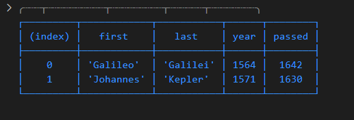
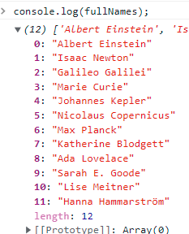

# JavaScript30

_Updating README with GIFs to replace static screenshots when the 30 days are complete._

Following the [30 day Vanilla JS Coding Challenge]https://javascript30.com/) from Wes Bos.

Building 30 things in (close to) 30 days with 30 tutorials.

## Day 1. JavaScript Drum Kit

A keyboard drum kit that plays sounds and changes the styling of elements based on what key is pressed.

## Day 2. JS and CSS Clock

A clock built with CSS that moves the hands using JavaScript Date methods.

## Day 3. Scoped CSS Variables and JS

CSS Variable Updater using sliders and a color picker.

## Day 4. Array Cardio Day 1

Working our brain muscles with array methods.

#### 1. Filter the list of inventors for those who were born in the 1500's.

#### 2. Give us an array of the inventors' first and last names. (Looked gross in VS Code debug console, ran in web console)

#### 3. Sort the inventors by birthdate, oldest to youngest.

#### 4. How many years did all the inventors live all together?

#### 5. Sort the inventors by years lived.

#### 6. Create a list of boulevards in Paris that contain 'de' anywhere in the name.

#### 7. Sort the people alphabetically by last name.

#### 8. Sum up the instances of repeated items in an array.

