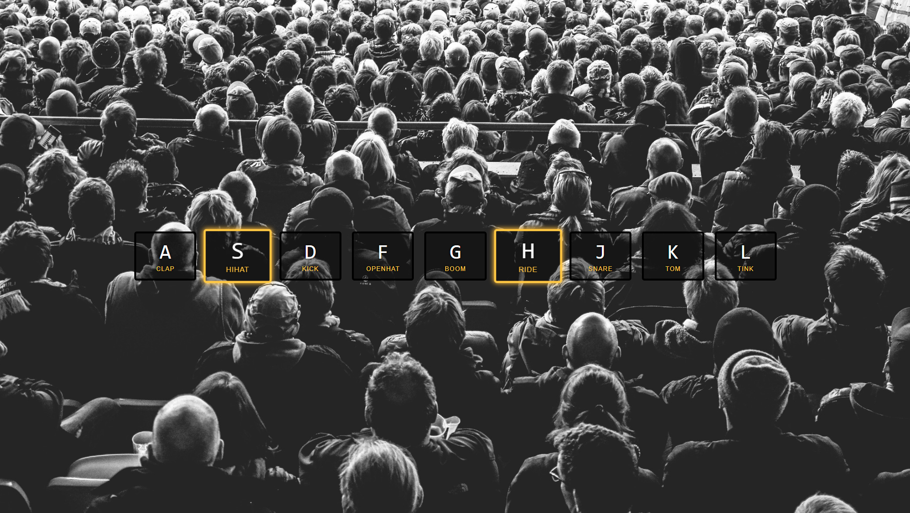

# JavaScript30

_Updating README with GIFs to replace static screenshots when the 30 days are complete._

Following the [30 day Vanilla JS Coding Challenge]https://javascript30.com/) from Wes Bos.

Building 30 things in (close to) 30 days with 30 tutorials.

## Day 1. JavaScript Drum Kit

A keyboard drum kit that plays sounds and changes the styling of elements based on what key is pressed.

## Day 2. JS and CSS Clock

A clock built with CSS that moves the hands using JavaScript Date methods.

## Day 3. Scoped CSS Variables and JS

CSS Variable Updater using sliders and a color picker.

