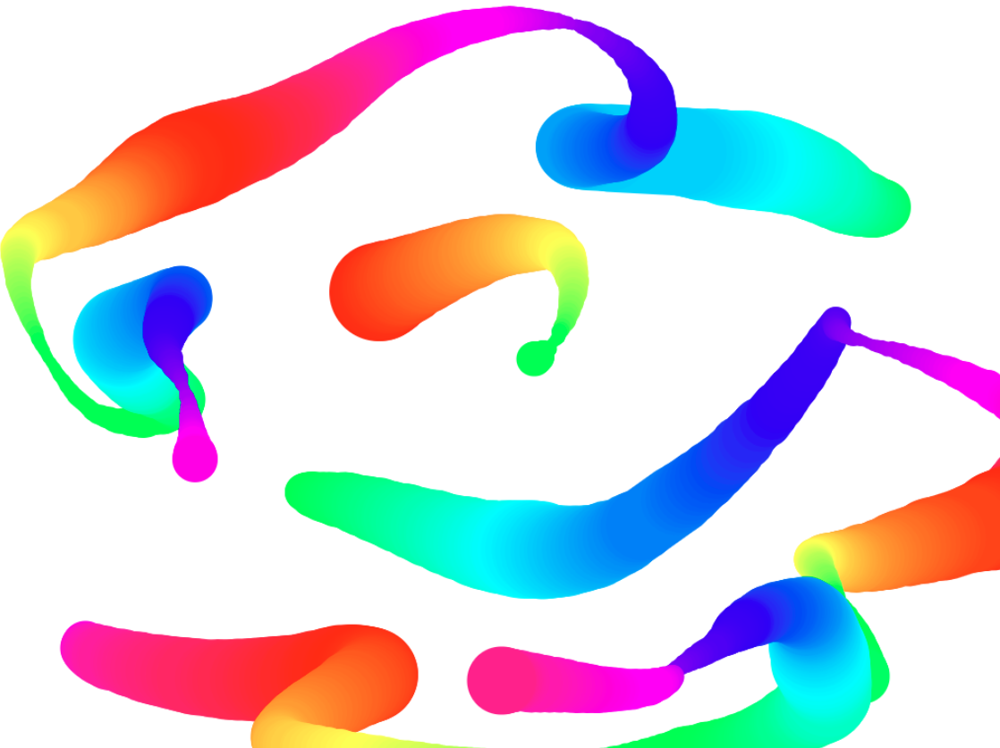

# JavaScript30

_Updating README with GIFs to replace static screenshots when the 30 days are complete._

_Creating landing page when complete as a little challenge and deploying to github pages for display_

Following the [30 day Vanilla JS Coding Challenge]https://javascript30.com/) from Wes Bos.

Building 30 things in (close to) 30 days with 30 tutorials.

## Day 1. JavaScript Drum Kit

A keyboard drum kit that plays sounds and changes the styling of elements based on what key is pressed.

## Day 2. JS and CSS Clock

A clock built with CSS that moves the hands using JavaScript Date methods.

## Day 3. Scoped CSS Variables and JS

CSS Variable Updater using sliders and a color picker.

## Day 4. Array Cardio Day 1

Working our brain muscles with array methods.

#### 1. Filter the list of inventors for those who were born in the 1500's.

#### 2. Give us an array of the inventors' first and last names. (Looked gross in VS Code debug console, ran in web console)

#### 3. Sort the inventors by birthdate, oldest to youngest.

#### 4. How many years did all the inventors live all together?

Instead of including a screenshot, I thought I would just explain this BECAUSE this problem only returns a single line. The reduce method loops over our array of inventors and subtracts the year they passed from the year they were born. It then adds that to a running total (starting at 0) until we reach the total years lived by all inventors (861 years).

#### 5. Sort the inventors by years lived.

#### 6. Create a list of boulevards in Paris that contain 'de' anywhere in the name.

**This problem warrants more description.**

1. Used the dev tools to grab the class of the element containing the list of boulevards in Paris in order to loop over them.
2. Grabbed the links within the element so that our code could read them.
3. Convert the list provided from a NodeList to an Array, because we're practicing with the map/filter methods, and not using the forEach that is available to NodeLists through the browser API. A brief explanation of the [differences between NodeLists and Arrays](https://gomakethings.com/nodelists-vs-arrays/).
4. Loop over the list of links and pull only the names of boulevards from the elements.
5. Filter through the list and only return boulevards with 'de' in them.

#### 7. Sort the people alphabetically by last name.

#### 8. Sum up the instances of repeated items in an array.

This problem really just loops over the array and adds each instance to an object with the key value pairs being "vehicle: # of times in array". The result: { car: 5, truck: 3, bike: 2, walk: 2, van: 2}

## Day 5. Flex Panels Image Gallery

An image gallery built using flexbox display properties/CSS animations, manipulated with JS.

## Day 6. AJAX Type Ahead Feature

A predictive text feature that matches a city or state that you type in and provides population information.

## Day 7. Array Cardio Day 2

This day returns console outputs. This day covered more array methods, such as: Some, Every, Find, and Find Index. We use findIndex() to search for a specific commeny by ID, and then remove it from the array based on that index.

## Day 8. Fun with HTML5 Canvas

An HTML canvas where we can click and drag to draw with a pen of rainbow colors that varies in width based on how fast the mouse moves.

## Day 9. Must Know Dev Tools/Tricks

Refreshing on Dev Tools used in the browser, as well as different ways of console logging.

## Day 10. Hold Shift to Check Multiple Checkboxes

An email inbox style layout that does exactly what it says on the tin: When you click on one item and then hold shift while clicking another one, it will check all of the items in between those two and check them.

## Day 11. Custom HTML5 Video Player

Building a custom interface with added controls for an HTML video player.

## Day 12. Key Sequence Detection (KONAMI CODE)

In Progress.

## Day 13. Slide in on Scroll

In Progress.

## Day 14. JavaScript References VS. Copying

In Progress.

## Day 15. LocalStorage

In Progress.

## Day 16. Mouse Move Shadow

In Progress.

## Day 17. Sort Without Articles

In Progress.

## Day 18. Adding Up Times with Reduce

In Progress.

## Day 19. Webcam Fun

In Progress.

## Day 20. Speech Detection

In Progress.

## Day 21. Geolocation

In Progress.

## Day 22. Follow Along Link Highlighter

In Progress.

## Day 23. Speech Synthesis

In Progress.

## Day 24. Sticky Nav

In Progress.

## Day 25. Event Capture, Propagation, Bubbling, and Once

In Progress.

## Day 26. Stripe Follow Along Nav

In Progress.

## Day 27. Click and Drag

In Progress.

## Day 28. Video Speed Controller

In Progress.

## Day 29. Countdown Timer

In Progress.

## Day 30. Whack A Mole

In Progress.

